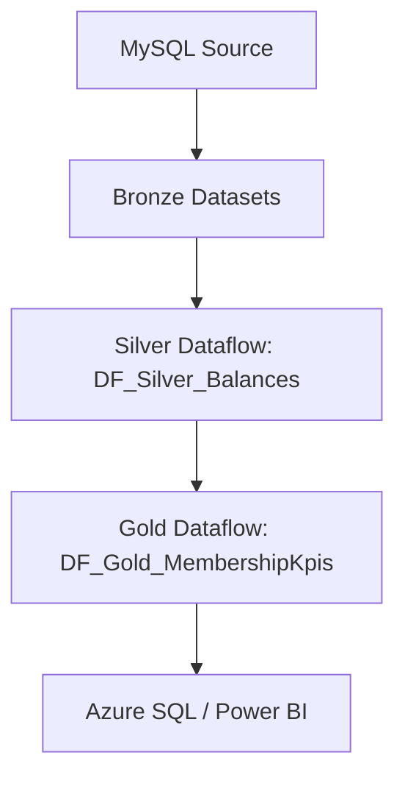

# Report 2 — Membresías y Utilización de Créditos

## Objetivo

Auditores y stakeholders utilizan este reporte para monitorear el **ciclo de vida de las membresías** y la **tasa de utilización de créditos** (sesiones). El objetivo es medir la retención de usuarios y asegurar que los créditos otorgados por membresías se consuman correctamente según los tipos de actividad.

---

## Métricas Clave

| Métrica | Descripción |
|---|---|
| **Consumo de Sesiones** | Suma de `value` negativo en la tabla `transactions`. |
| **Balance de Créditos** | Suma acumulada de `value` (grants - consumos) por usuario y actividad. |
| **Penetración por Plan** | Distribución de usuarios activos (`users_memberships`) por tipo de membresía. |
| **Engagement Rate** | Relación entre créditos otorgados y créditos consumidos en el periodo. |

---

## Fuentes de Datos (Esquema MySQL)

| Tabla | Rol | Columnas Clave |
|---|---|---|
| `users` | Perfiles | `id`, `name`, `createdAt`, `banned` |
| `memberships` | Catálogo | `id`, `name`, `color` |
| `users_memberships` | Asignación | `user` (FK), `membership` (FK) |
| `transactions` | **Auditoría** | `userID`, `membershipID`, `activityID`, `value` (+/-) |
| `memberships_activityTypes` | Reglas | `membership`, `activity`, `amount`, `period` |

---

## Pipeline ADF: `PL_Report_Membership_Utilization`

### Estructura general



---

## Paso 1 — Ingesta a Bronze (SQL Extract)

### Extract_Transactions
Identifica el consumo real de actividades. Un `value < 0` indica uso de sesión.
```sql
SELECT 
    userID, 
    membershipID, 
    activityID, 
    value, 
    id as transactionID 
FROM transactions;
```

### Extract_User_Plans
Mapea usuarios a sus membresías actuales.
```sql
SELECT 
    user, 
    membership 
FROM users_memberships;
```

### Extract_Users (Nuevos registros)
```sql
SELECT id, name, createdAt
FROM users
WHERE verified = 1 AND banned = 0;
```

---

## Paso 2 — Silver: Auditoría y Lógica de Negocio

En esta fase, los datos crudos de **Bronze** se transforman en un libro mayor (ledger) de créditos para determinar el estado real de cada usuario.

### `DF_Silver_UsageAudit` (Lógica de Transformación)

#### 1. Categorización de Movimientos (Derived Column)
Primero, clasificamos cada transacción para facilitar el cálculo de KPIs:
- `IsConsumption`: `iif(value < 0, 1, 0)` -> Marca cuando un usuario usa una sesión.
- `IsGrant`: `iif(value > 0, 1, 0)` -> Marca cuando se le otorgan créditos a un usuario.
- `AbsoluteValue`: `abs(value)`

#### 2. Enriquecimiento de Datos (Joins)
Realizamos una serie de Joins para contextualizar la utilización:
- **Inner Join** con `Bronze_memberships` sobre `membershipID`:
    - Trae: `membership_name`, `color`.
- **Left Join** con `Bronze_memberships_activityTypes` sobre `membershipID` Y `activityID`:
    - Trae: `amount` (Entitlement previsto) y `period` (Ej: 'monthly', 'weekly').
    - *Nota*: Esto permite comparar cuántas sesiones *debería* tener el usuario vs cuántas ha consumido.

#### 3. Cálculo de Saldo en Tiempo Real (Windowing)
Para saber cuántos créditos le quedan a un usuario en un momento dado:
```javascript
// Window: partitionBy(userID, activityID), orderBy(transactionID ASC)
current_balance = sum(value) over (
    partitionBy: [userID, activityID], 
    orderBy: transactionID ASC
)
```

#### 4. Slicing por Periodo (Lógica de Negocio)
Dado que las membresías tienen periodicidad (Ej: 10 sesiones al mes), el DataFlow debe:
- Generar un `period_id` basado en `transaction_createdAt` (Ej: '2024-03').
- Agrupar consumos por ese `period_id` para validar si el usuario excedió su límite de membresía.

**Sink** → `Silver_user_balances` (Ubicado en el ADLS Gen2 como Parquet).

---

## Paso 3 — Gold: KPIs de Retención

### `DF_Gold_UserLifeCycle`

**Source** → `Silver_user_balances` JOIN `Bronze_users`

1. **Aggregate** por `registration_ym` y `membershipID`:
   - `total_active_users = countDistinct(userID)`
   - `total_sessions_consumed = sum(usage_flag)`
   - `avg_balance_per_user = avg(current_balance)`

2. **Sink** → `DS_AzureSQL_fact_membership_kpis`

---

## Esquema Gold (Azure SQL Target)

### `fact_membership_activity`
```sql
CREATE TABLE fact_membership_activity (
    report_date           DATE          NOT NULL,
    membership_name       VARCHAR(100),
    active_subscribers    INT           DEFAULT 0,
    sessions_consumed     INT           DEFAULT 0,
    total_credits_granted INT           DEFAULT 0,
    etl_run_id           VARCHAR(50),
    PRIMARY KEY (report_date, membership_name)
);
```

---

## Visualización Sugerida (Power BI)

1. **Dashboard de Utilización**: Treemap de `membership_name` por `sessions_consumed`.
2. **Saldo Crítico**: Tabla de usuarios con `current_balance < 2` (Alertas de renovación).
3. **Tendencia de Crecimiento**: Línea de tiempo con `active_subscribers` MoM.

---

> [!NOTE]
> Las inconsistencias previas en los nombres de campos (`user` vs `userID`) han sido corregidas para garantizar la integridad referencial en el pipeline ETL.
